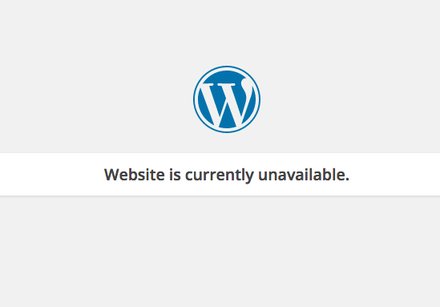

# WP Site Suspended

Simple [drop-in](https://codex.wordpress.org/Must_Use_Plugins) plugin to alter the page a visitor sees when a site is suspended in MultiSite. Or in this case, archived.

**Note: For MultiSite Use**

## Why

I needed something other than the default, generic message that WP displayed when we suspended a site in our network for whatever reason.

## Installation

Don't upload or install it like normal, the file you need is `blog-suspended.php` and it needs to reside in `wp-content`.

## Usage

Once installed it will replace the default message with one that matches your standard WP login screen. I use it in conjunction with [Simple Login Customizer](https://github.com/thatryan/simple-login-customizer) so that the custom logo and footer messages I set in there get added to the suspended site page.

To edit the message displayed to visitors, just edit it in the file, 

    <h2>Website is currently unavailable.</h2>
    
## What Does It Look LIke

Default view

View in conjunction with [Simple Login Customizer](https://github.com/thatryan/simple-login-customizer)

That is all for now!
